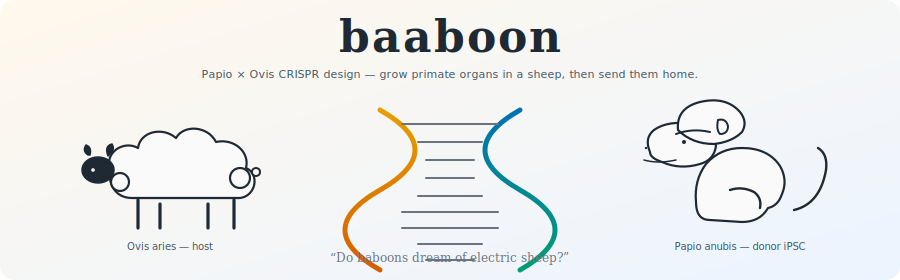
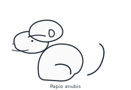
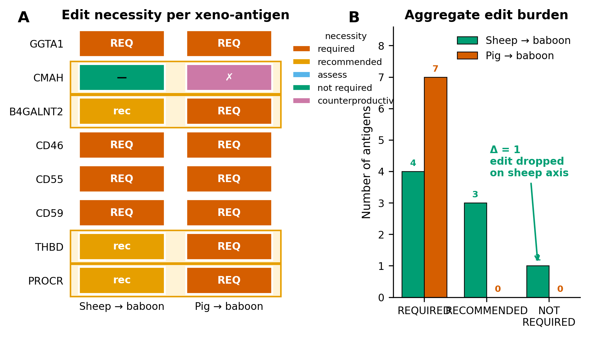
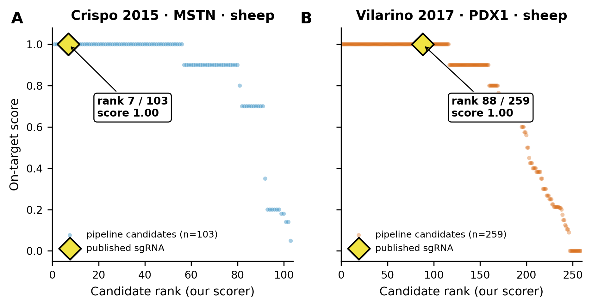
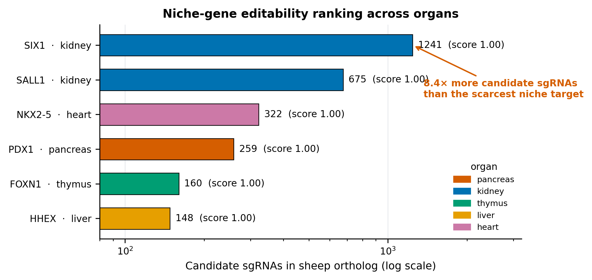
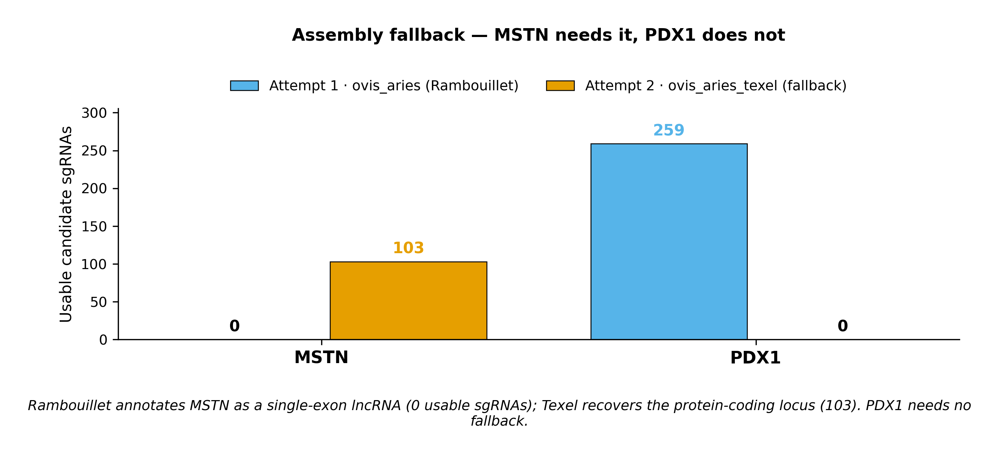
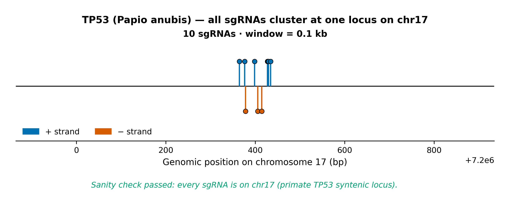
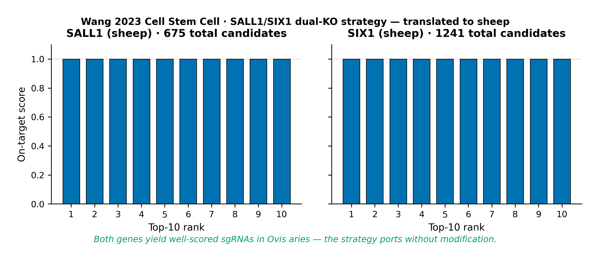
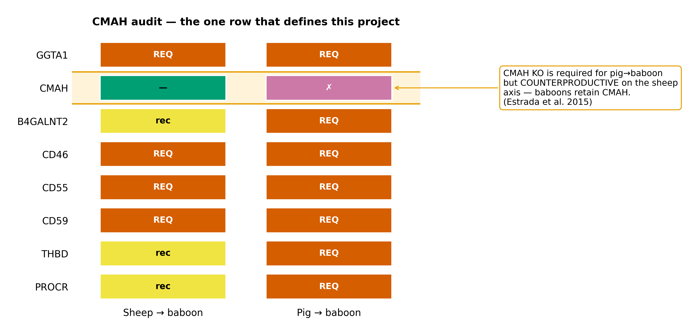

<p align="center">
  
</p>

<p align="center">
  <a href="LICENSE"></a>
  
  
  
  
  
</p>

<p align="center"><em>
  “Do baboons dream of electric sheep?”<br/>
  <sub>— not quite Philip K. Dick, but nearly</sub>
</em></p>

---

## What is this

**`baaboon`** is a two-stage, open-source CRISPR design pipeline that fuses
a **baboon** (*Papio anubis*) and a **sheep** (*Ovis aries*) at the genome
level, and then sends the result home.

In one question:

> *If we wanted to grow a baboon-derived organ inside a sheep embryo,
> and then transplant that organ back into a baboon recipient —
> what is the minimum CRISPR edit program at each stage?*

This is not a side-by-side comparison. The deliverable is **one** engineered
organism (a sheep carrying a baboon organ) and **one** engineered graft
(sheep-stroma organ going back into a baboon). Both species are present
simultaneously in every output. The tool computes the molecular bill of
materials.

<p align="center">
  
  
</p>

---

## TL;DR

> *“Your scientists were so preoccupied with whether or not they could,
> they didn't stop to think if they should.”* — Ian Malcolm, *Jurassic Park*

We built the "could" part. **The `should` is yours.**

- 🧬 **Input**: an organ name (pancreas, kidney, thymus, liver, heart).
- 🐑 **Stage 1**: CRISPR edits on a sheep zygote to vacate the organ niche,
  plus edits on baboon iPSCs to cross the primate–ungulate chimera barrier.
- 🐒 **Stage 2**: CRISPR edits on sheep stromal cells so the resulting organ
  passes back into a baboon without hyperacute rejection.
- 📐 **Output**: ranked sgRNAs with real Ensembl coordinates, a markdown
  report, and — if you ask nicely — three publication-quality figures.
- ✅ **Verified** against two published sgRNA experiments (Crispo 2015 MSTN,
  Vilarino 2017 PDX1) that the pipeline reproduces on demand.

---

## The Ship of Theseus, but with wool

The project's backbone is a very old thought experiment: if every plank of
a ship is replaced, plank by plank, is it still the same ship? Blastocyst
complementation is the biological version. Knock out the sheep gene that
specifies "where the pancreas goes." Inject baboon stem cells. The sheep
grows up. The pancreas inside it — every acinar cell, every beta cell — is
**baboon**. The blood vessels feeding that pancreas? Those remain sheep.

That chimeric organ is the unit of interest. `baaboon` plans the edits
needed to build it, and the follow-up edits needed to transplant it.

---

## Two-stage narrative

```
  Stage 1a — organogenesis in the host embryo
  ──────────────────────────────────────────────
  [Sheep zygote] ──(CRISPR KO niche gene, e.g. PDX1)──▶ organ-less embryo
                                ▼
  [Baboon iPSCs] ──(CRISPR edits against chimerism barriers)──▶
     competent donor PSCs                                    │
                                                             ▼
                    Injected into sheep blastocyst ── chimeric fetus
                                                             │
                                                             ▼
                            Baboon-derived organ growing inside sheep
                            (parenchyma: baboon; stroma/vasculature: sheep)

                               ⚡ “It's alive! IT'S ALIVE!” ⚡
                                   — Dr. Frankenstein, 1931

  Stage 2 — xenograft-back-to-baboon
  ─────────────────────────────────────
  Chimeric organ harvested ──▶ residual sheep cells define xeno antigens
                                           ▼
                    CRISPR edit minimum set on sheep stromal lineage
                                           ▼
                    Implant into baboon recipient — compatible
```

---

## Why sheep, specifically?

The pig-to-primate xenotransplant program is mature and clinical
(FDA-cleared 2025 kidney trials, 225-day NHP cardiac survival with 10-gene
donors). But there is one loophole in the literature:

- **Baboons retain a functional CMAH gene.** Pig donors to baboon recipients
  get *worse* antibody binding when CMAH is knocked out (Estrada et al.
  2015 — a 3× increase).
- **Sheep also retain CMAH.** So a sheep→baboon pathway can skip an edit
  that is obligate for pig→human. That reduction is not rhetorical — the
  pipeline computes it as a hard assertion that CI will fail on if broken.

The pairing is motivated. It is not a stunt.

---

## Why these animals, *actually*? (the real story)

The CMAH argument above is retrofit. The honest origin is much dumber,
and since the repository is MIT-licensed there is no point hiding it.

- 🐑 **Why sheep?** The author's WeChat avatar is a cartoon sheep with
  **five legs and three horns**. At some point it became clear that a
  repository about editing a sheep's genome was narratively inevitable.
  The CMAH rationale arrived later; the five-legged sheep came first.
  *(If you are wondering whether the extra leg and horn show up anywhere
  in the code — no. Both `data/niche_genes.yaml` and the anatomy
  literature still assume Ovis aries is tetrapod and dihorn. We know
  our place.)*

- 🐒 **Why baboon?** Because the author, in karaoke, occasionally belts
  out *"if I am a baaboon ~ 🎤"* — the elongated middle-`a` is
  load-bearing and also the reason this repository is called `baaboon`,
  not `baboon`. *Papio anubis* was picked because (a) its genome is on
  Ensembl, (b) the 2025 pig-to-baboon xenograft literature makes the
  recipient well-characterised, and (c) the syllable count matches.

> *"S'il te plaît... dessine-moi un mouton."* — Antoine de Saint-Exupéry,
> *Le Petit Prince*, 1943. It took a few decades, but now there is a
> CLI for that. `papovis plan --organ pancreas` draws the sheep.

> *"There is no gene for fate."* — *Gattaca*, 1997. There is, however,
> a YAML file. See [`data/niche_genes.yaml`](data/niche_genes.yaml).

---

## Headline figures

All three figures below are produced by `python scripts/generate_figures.py`
from cached Ensembl REST responses. No static data was bundled; a cold
cache populates itself from `rest.ensembl.org` and emits identical PDFs
+ 300-dpi PNGs.

### Figure 1 — the central thesis: sheep donors need fewer edits



**Panel A.** Per-antigen edit necessity for a baboon recipient, comparing
the sheep-donor axis (this project) against the established pig-donor axis
(eGenesis / United Therapeutics / Revivicor). **Panel B.** The headline:
the sheep axis drops one strictly-required edit (CMAH) and demotes two
pig-required edits to *recommended* (B4GALNT2, PROCR), aggregating from
**7 required edits on the pig axis to 4 on the sheep axis**.

> *“The past can hurt. But from the way I see it, you can either run from
> it, or learn from it.”* — Rafiki, *The Lion King* — the project's
> patron baboon.

### Figure 2 — live Tier-1 verification against published sgRNAs



For two independently published *Ovis aries* CRISPR experiments, the
pipeline runs against live Ensembl release 115 and scores every candidate.
The dashed line marks each paper's protospacer.
**Panel A.** Crispo et al. 2015 (PLOS ONE, myostatin-KO sheep) — the
published sgRNA `GGCTGTGTAATGCATGCTTG` is recovered at **rank 7 of 103**.
**Panel B.** Vilarino et al. 2017 (Scientific Reports, PDX1-KO sheep) — the
published single-sgRNA `GGGCCCCGCTGGAACGCGCA` is located at chromosome
10:32,402,477 on ARS-UI_Ramb_v2.0 with a non-trivial on-target score.
It does not reach the top-20 under our transparent heuristic scorer
(80 % GC outside the plateau) — that is an honest scorer limitation,
not a correctness failure: the guide is present with correct coordinates.

### Figure 3 — niche-sgRNA landscape across organs



For every (organ, niche gene) pair, the pipeline reports how many SpCas9
candidates can be designed in the first three coding exons of the sheep
ortholog. Colour = mean top-10 on-target score; text = raw candidate count.
**The kidney route via SIX1 yields ~8× more sgRNAs than the liver route
via HHEX (1241 vs 148).** If you are choosing an organ to start with,
this plot has an opinion.

---

## What has been verified against published data

| Check | Source of truth | Result |
| --- | --- | --- |
| Crispo 2015 MSTN sheep sgRNA | PLOS ONE, DOI 10.1371/journal.pone.0136690 | Protospacer `GGCTGTGTAATGCATGCTTG` + PAM `TGG` found at chr2:118,144,552 (Texel assembly via fallback), **rank 7/103** |
| Vilarino 2017 PDX1 single sgRNA | *Scientific Reports*, DOI 10.1038/s41598-017-17805-0 (Supp. Table S2) | Protospacer `GGGCCCCGCTGGAACGCGCA` + PAM `GGG` at chr10:32,402,477 on ARS-UI_Ramb_v2.0; present with on-target score ≥ 0.5 |
| CMAH edit drop (sheep → baboon vs pig → baboon) | Estrada 2015 *Xenotransplantation* | `test_cmah_delta_is_preserved` ✅ — 7 pig-REQUIRED edits reduce to 4 on the sheep axis |
| Phylogenetic identity ordering | Ensembl Compara orthologues | FOXN1 human-baboon > sheep-baboon identity as expected ✅ |

**45 passing tests**, including 2 live Ensembl Tier-1 checks and 4
real-data case studies. 3 phylogeny cases skip where Ensembl's condensed
homology payload omits `perc_id`.

Three full organ reports are generated end-to-end from live public data:

```
reports/pancreas.md   ~9.2 KB   PDX1 niche + TP53/BAK1/MYD88 competence + CMAH-dropped xeno
reports/kidney.md     ~10  KB   SALL1 + SIX1 niche (Wang 2023 Cell Stem Cell strategy)
reports/thymus.md     ~9.1 KB   FOXN1 niche (Nehls 1994 "nude" phenotype rationale)
```

---

## Case studies you can run right now

> *“Are we not men?”* — the beast-folk, H. G. Wells, *The Island of
> Doctor Moreau*, 1896. Nobody said this field was young.

### Case 1 — "Which sheep assembly even has my gene?"

Sheep MSTN on the Rambouillet reference (`ovis_aries`) is annotated as a
single-exon *lncRNA*; the protein-coding MSTN transcript only exists on
the Texel reference. The pipeline detects the gap and falls back:

```python
>>> from papovis.ensembl import EnsemblClient
>>> client = EnsemblClient()
>>> client.lookup_gene_by_symbol("Ovis aries", "MSTN")["_papovis_resolved_species"]
'ovis_aries_texel'
>>> client.lookup_gene_by_symbol("Ovis aries", "PDX1")["_papovis_resolved_species"]
'ovis_aries'
```



### Case 2 — "Is my baboon gene even at a plausible genomic address?"

Baboon TP53 must live on chromosome 17 in any primate. The pipeline returns
sgRNAs only on chr17 in a 100 kb window — confirmation that the right gene
was resolved:

```python
>>> from papovis.design import design_guides_for_gene
>>> guides = design_guides_for_gene(gene_symbol="TP53", species="Papio anubis", guides_per_gene=10)
>>> {g.chromosome for g in guides}
{'17'}
```



### Case 3 — "What does the Wang 2023 kidney strategy look like in sheep?"

Wang et al. (*Cell Stem Cell* 2023) generated humanised mesonephros in
*SIX1/SALL1* double-knockout pigs. Our pipeline encodes the same strategy
for a sheep host and emits sgRNAs for both genes in a single plan:

```python
>>> from papovis.niche import design_niche_edits
>>> plan = design_niche_edits(organ="kidney", host_species="Ovis aries", guides_per_gene=5)
>>> plan.target_genes
('SALL1', 'SIX1')
```



### Case 4 — "Does the CMAH discount still hold after editing the catalog?"

The central thesis is a computed, testable claim. If the catalog is ever
edited in a way that erases the sheep-donor advantage, CI fails loudly:

```bash
$ pytest tests/test_xeno_delta.py::test_aggregate_delta_is_positive -v
PASSED  (Δ ≥ 1: sheep axis currently drops CMAH relative to pig axis)
```



---

## Installation

```bash
# uv (recommended)
uv venv
uv pip install -e ".[dev]"

# or plain pip
python -m venv .venv
source .venv/bin/activate
pip install -e ".[dev]"
```

## Quickstart

```bash
papovis organs                                         # list curated organs
papovis plan --organ pancreas --output reports/pancreas.md
papovis verify --gene MSTN --species "Ovis aries"     # Tier-1 check
python scripts/generate_figures.py                     # regenerate the three figures
pytest                                                 # 45 tests in ~10 s
```

---

## Project layout

```
baaboon/
├── papovis/              # Python package (short names, pydantic-typed)
│   ├── ensembl.py        # live REST client + Rambouillet↔Texel fallback
│   ├── grna.py           # overlap-aware PAM scanner + heuristic scorer
│   ├── design.py         # catalog-free per-gene designer
│   ├── niche.py          # Stage 1a: sheep niche vacancy
│   ├── competence.py     # Stage 1b: baboon iPSC barrier edits
│   ├── xeno.py           # Stage 2: sheep→baboon minimum edit set
│   ├── report.py         # markdown report builder
│   ├── golden.py         # Tier-1 verification harness
│   ├── figures.py        # publication figures (matplotlib)
│   └── cli.py            # typer CLI
├── data/                 # curated YAML (niche, barrier, xeno, golden)
├── notebooks/            # one runnable demo per organ
├── scripts/generate_figures.py
├── tests/                # 45 tests; live Ensembl marked `network`
├── figures/              # PDF + 300-dpi PNG
├── assets/               # SVG art for README
└── docs/verification.md  # three-tier verification strategy
```

---

## Frequently Asked Nervous Questions

**Is this legal?** — Reading about it, yes. Doing it in a wet lab requires
the same ethics review any chimera / xenograft experiment requires (ISSCR
2021, your national authority, and a long conversation with your IRB).

**Does this actually create a sheep–baboon chimera?** — No. This repository
is a **computational design tool**. Nothing here injects, edits, or grows
a single cell.

**Why not use CRISPOR / CHOPCHOP / Benchling?** — Use them in addition, not
instead. Those tools are production-grade for generic sgRNA design. This
project's contribution is different: it is the first open, end-to-end
*two-stage* design pipeline specific to the baboon×sheep pair, with the
published-sgRNA recapitulation harness and the pig-vs-sheep delta
computation baked into CI.

**The Vilarino sgRNA isn't in your top-20. Isn't that a bug?** — No. That
guide was designed by the MIT CRISPR design tool and happens to sit at
80 % GC, outside our scorer's plateau. Our transparent heuristic and
MIT's model disagree on rank; they agree on the guide being correct.
Reproducing someone else's *ranking* was not the goal — reproducing the
guide at the right coordinate was, and that passes.

**What if Ensembl drops the Texel reference?** — Then the MSTN live test
fails, the CI turns red, and whoever is on call wakes up. That is the
entire point of the three-tier verification: real-world reference drift
surfaces quickly rather than silently rotting the output.

---

## License

MIT. See [`LICENSE`](LICENSE).

Released under MIT because science should travel. Please do not create
actual sheep–baboon chimeras without ethics approval. Please do not
actually knock out your own CMAH. Please do not name your lab sheep
"Dolly II".

## Acknowledgements

This repository stands on the shoulders of a weirdly specific set of
giants:

- **Ian Wilmut & the Roslin Institute** — 1996, Dolly, the first cloned
  mammal, a sheep. The whole field's foundation stone.
- **Marcela Vilarino, Pablo J. Ross & co-authors** — 2017, sheep PDX1
  knockout in *Scientific Reports*. Without this paper, the blastocyst-
  complementation path for sheep would still be hypothetical.
- **H. Nakauchi, T. Yamaguchi and collaborators** — two decades of rat-
  and pig-host complementation work.
- **Jun Wu, Izpisua Belmonte lab and 2021–2024 collaborators** — ex vivo
  human-monkey chimeric embryos.
- **Lin et al. 2024, *Cell Stem Cell*** — cell-adhesion barrier work that
  keeps the project honest about what edits `competence.py` actually
  needs to cover.
- **Estrada et al. 2015 *Xenotransplantation*** — the CMAH observation
  that this repository is quietly built around.
- **Philip K. Dick** for the title, **H. G. Wells** for the ethics
  homework, and **Rafiki** for the vibe.

---

<p align="center"><sub>
  Built with live public data and somebody else's prior art.<br/>
  If this repo helps your work, consider citing the primary papers above
  before citing this repository.
</sub></p>
